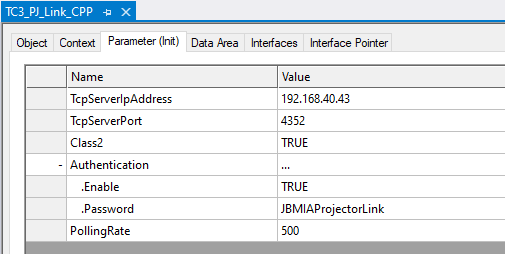

# About This Repository

This repository includes a C++ implementation of PJ Link Client. With this C++ project compiled into TcCom form, it can send commands to supported projectors and request status; such as lamp time, filter time, etc. The program also implements a MD5 hash for sending commands to password protected PJ Link devices.

Note the primary settings of the TcCom:

- Class 2 will enable Class 2 message support, if the projector supports it.
- Authentication can be enabled, if it is required, but not enabled, fail to connect should be reported
- Polling rate in (ms) for status update messages. Most projectors required <2s for polling.

This sample is created by [Beckhoff Automation LLC.](https://www.beckhoff.com/en-us/), and is provided as-is under the Zero-Clause BSD license.

# How to get support

Should you have any questions regarding the provided sample code, please contact your local Beckhoff support team. Contact information can be found on the official Beckhoff website at https://www.beckhoff.com/en-us/support/.

# Further Information

[Test Client](https://pjlink.jbmia.or.jp/english/data_cl2/PJLink_5-2.zip)

[PJ Link Documentation](https://pjlink.jbmia.or.jp/english/data_cl2/PJLink_5-1.pdf)

## Requirements

The following components must be installed to run sample code:

- [TE1000 TwinCAT 3 Engineering](https://www.beckhoff.com/en-en/products/automation/twincat/te1xxx-twincat-3-engineering/te1000.html) version 3.1.4024.0 or higher
- Microsoft Visual Studio 2019 with C++ Compilers
- TF6311 Realtime TCP
  

## Disclaimer

All sample code provided by Beckhoff Automation LLC are for illustrative purposes only and are provided “as is” and without any warranties, express or implied. Actual implementations in applications will vary significantly. Beckhoff Automation LLC shall have no liability for, and does not waive any rights in relation to, any code samples that it provides or the use of such code samples for any purpose.
